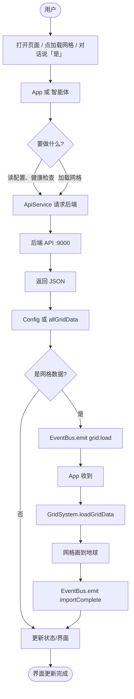
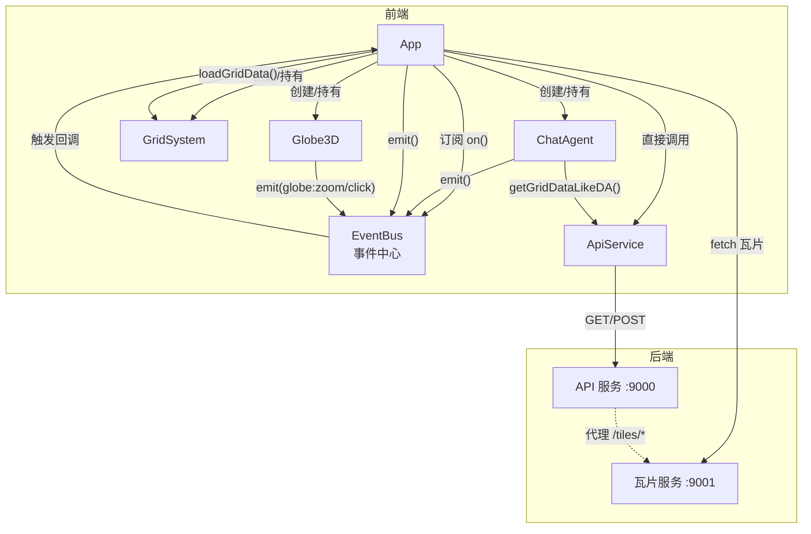
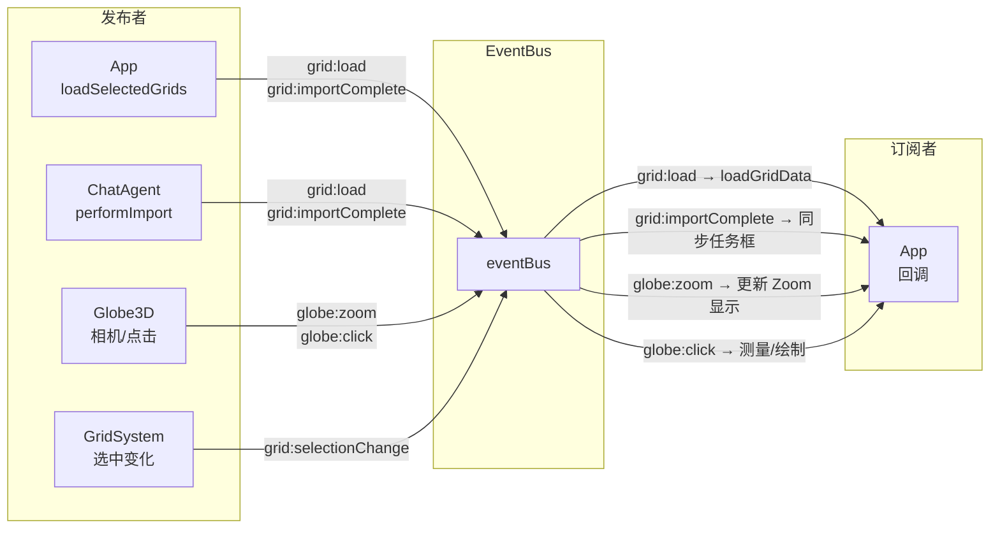
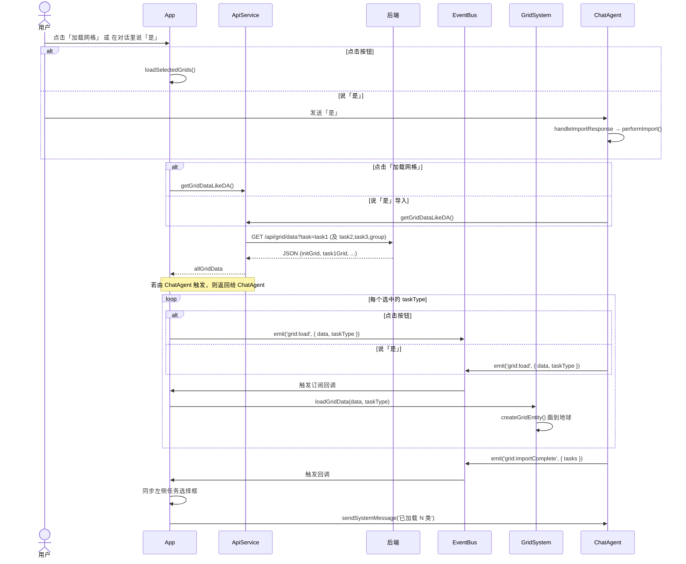
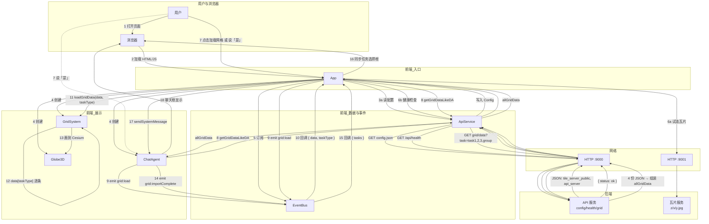
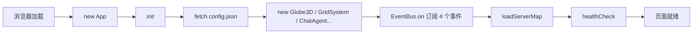
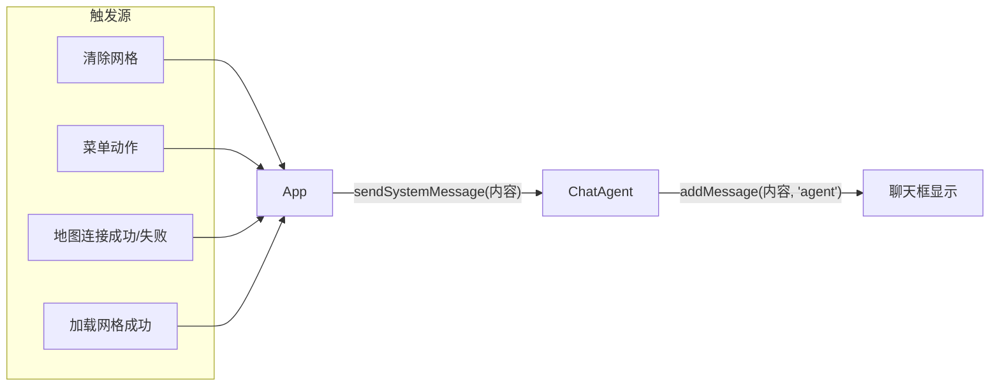

# DA智能体系统 - 数据交互与通信说明（详细版）

## 总流程图



- **用户**：打开页面、点「加载网格」、或在对话里说「是」导入。
- **App / 智能体**：根据操作调 ApiService 或发 EventBus 事件。
- **后端**：返回 config、health 或 4 类网格 JSON；ApiService 组装成 allGridData。
- **网格路径**：allGridData → emit('grid:load') → App 回调 → GridSystem 画到地球 → emit('grid:importComplete') → 同步任务框、聊天提示。

---

本文档用**具体步骤**和**实际数据示例**说明：数据在谁和谁之间、以什么形式、在什么时机传递。适合开发与联调时对照代码阅读。

---

## 一、怎么读这份文档

- **「谁 → 谁」**：表示前者调用后者，或前者把数据发给后者。
- **「数据长什么样」**：会给出简化后的 JSON 或对象结构，便于和实际请求/响应对照。
- **「代码位置」**：标注关键逻辑所在文件，便于在工程里搜索。
- 建议先看 **「信号流图总览」** 和 **第二、三、四章** 的三个完整场景，再看后面事件表与接口表作查表用。

---

## 二、信号流图总览

### 2.1 系统整体信号流（谁和谁通信）



**图例**：实线 = 直接调用或数据请求；虚线 = 代理转发。EventBus 为发布/订阅，emit 方不直接调订阅方。

### 2.2 EventBus 事件流（谁发、谁收）



### 2.3 「加载网格」信号流（点击按钮 或 对话说「是」）



### 2.4 完整通信数据流程（端到端 + 数据形态）

下面用**一张总图**和**一张按步骤的数据交互表**，把「数据从哪来、到哪去、长什么样」串成一条完整链路。分为两条主流程：**流程 A 页面加载**、**流程 B 网格加载**（按钮或对话触发）。

#### 总图：端到端数据流



**图例**：实线 = 请求/调用/数据返回；虚线 = 用户另一入口。数字为大致顺序，便于与下表对照。

#### 数据交互步骤表（每一步的输入/输出）

表中「输入」= 该步骤收到的数据，「输出」= 该步骤产生并传给下一步的数据。

**流程 A：页面加载**

| 步骤 | 从谁到谁 | 输入数据 | 输出数据 / 行为 |
|------|----------|----------|------------------|
| 1 | 用户 → 浏览器 | 打开 URL | 请求 index.html、app.js |
| 2 | 浏览器 → App | DOMContentLoaded | new App() → init() |
| 3a | App → ApiService → 后端 | 无（或 apiBase） | GET /config.json |
| 3b | 后端 → ApiService → App | `{ "tile_server_public", "tiles_dir", "api_server" }` | 写入 Config，供后续请求用 |
| 4 | App → ChatAgent / GridSystem / Globe3D | 无 | 创建实例，GridSystem 持有 globe3d 引用 |
| 5 | App → EventBus | 回调函数 | eventBus.on('grid:load' 等 4 个) |
| 6a | App → 瓦片服务 | 瓦片 base + 路径如 1/0/0.jpg | HEAD/GET，成功则 globe3d.setImageryFromTileServer(base) |
| 6b | App → ApiService → 后端 | 无 | GET /api/health → `{ status: 'ok' }` → 更新状态栏 Online |

**流程 B：网格加载（点击按钮 或 对话说「是」）**

| 步骤 | 从谁到谁 | 输入数据 | 输出数据 / 行为 |
|------|----------|----------|------------------|
| 7 | 用户 → App 或 ChatAgent | 点击「加载网格」或输入「是」并发送 | App.loadSelectedGrids() 或 ChatAgent.handleImportResponse → performImport() |
| 8 请求 | App 或 ChatAgent → ApiService | 无参数 | getGridDataLikeDA() 内部发 4 个 GET：task=task1,task2,task3,group |
| 8 请求 | ApiService → 后端 | URL + ?task=xxx | 每个请求对应一个 JSON 文件内容 |
| 8 响应 | 后端 → ApiService | task1: `{ initGrid, task1Grid }`；task2: `{ task2Grid }`；task3/group 同理 | 4 个响应 |
| 8 组装 | ApiService 内部 | 4 份 JSON | 组装为 `allGridData = { initGrid, task1Grid, task2Grid, task3Grid, groups }`（数组元素为 `{ gridIndex, latitude, longitude, length, width }`） |
| 8 返回 | ApiService → App 或 ChatAgent | — | 返回 allGridData（Promise resolve） |
| 9 | App 或 ChatAgent → EventBus | `eventBus.emit('grid:load', { data: allGridData, taskType })`，对每个有数据的 taskType 发一次 | EventBus 通知所有订阅者 |
| 10 | EventBus → App | `{ data, taskType }`（即上面的 payload） | 执行 App 的 grid:load 回调 |
| 11 | App → GridSystem | `loadGridData(data, taskType)` | GridSystem 读取 `data[taskType]` 得到该类型网格数组 |
| 12 | GridSystem 内部 | 单条 grid：`{ gridIndex, latitude, longitude, length, width }` | createGridEntity(grid, taskType) 计算四角、颜色，准备 Cesium 实体 |
| 13 | GridSystem → Globe3D（Cesium） | 多边形 + 标签 | viewer.entities.add(...)，地图上显示网格 |
| 14 | ChatAgent → EventBus | `eventBus.emit('grid:importComplete', { tasks: ['initGrid','task1Grid',...] })` | EventBus 通知订阅者 |
| 15 | EventBus → App | `{ tasks }` | App 回调：把左侧任务选择框的选中项设为 tasks |
| 16 | App → DOM | 选中项与 tasks 一致 | 用户看到任务框勾选与已加载一致 |
| 17 | App → ChatAgent | sendSystemMessage('✅ 已加载 N 类网格数据') | ChatAgent.addMessage(内容, 'agent') |
| 18 | ChatAgent → DOM | 一条 Agent 消息 | 聊天框追加一条气泡 |

**小结（数据怎么交互）**：

- **配置与健康**：浏览器 → App → ApiService → HTTP GET → 后端返回 JSON → 写回 Config / 更新 UI。
- **网格数据**：用户操作 → App 或 ChatAgent → ApiService → 4 次 GET → 后端返回 4 份 JSON → ApiService 组装 allGridData → 通过 EventBus.emit('grid:load', { data, taskType }) 把**同一份 data** 多次发出（每次不同 taskType）→ App 回调收 → GridSystem 用 data[taskType] 取数组 → 逐条转 Cesium 实体画到 Globe3D。
- **系统提示**：App 直接调 ChatAgent.sendSystemMessage(字符串)，不经过 EventBus，数据就是一段文本，最终在聊天 DOM 显示。

---

## 三、核心概念（先建立印象）

1. **前端是单页应用**：页面里只有一个「应用」对象 `App`，它创建了 3D 地球、网格、智能体聊天、面板、右键菜单等，并负责协调它们。
2. **组件之间不直接互相调用**（除了 App 会直接调 GridSystem、ChatAgent 等）：**网格加载、导入完成、地图点击/缩放** 等通过一个叫 **EventBus** 的「事件中心」转发。A 发出事件并带上数据，B 事先订阅了该事件，就会收到数据并执行自己的逻辑。
3. **和服务器通信**：前端通过 **HTTP** 请求后端（默认 `http://127.0.0.1:9000`），用 **ApiService** 发请求；瓦片图由另一个服务（默认 9001）或经 9000 代理提供。
4. **智能体（ChatAgent）**：负责右侧聊天框的对话和「在对话里触发网格导入」。它**不直接操作** 3D 地球或网格，而是通过 **ApiService 拉数据 + EventBus 发事件**，让 App 和 GridSystem 去加载网格；同时 App 会在很多操作（如地图连上/断开、清除网格等）时，通过 **sendSystemMessage** 在聊天里替「系统」说一句话。

下面用三个完整场景把「数据怎么走」串起来。

---

## 四、场景一：打开页面时，数据是怎么流动的

从你打开页面到看到地球、状态栏、聊天框，大致顺序如下。每一步都标出「谁 → 谁」和「数据是什么」。

**场景一信号流简图：**



### 4.1 页面加载，创建 App

| 步骤 | 谁 → 谁 | 做了什么 | 数据/说明 |
|------|---------|----------|-----------|
| 1 | 浏览器 | 加载 `index.html`，执行 `app.js`，在 `DOMContentLoaded` 时执行 `new App()` | 无 |
| 2 | App 构造函数 | 保存 `globe3d / gridSystem / chatAgent / panelManager / contextMenu` 等引用，并调用 `this.init()` | 见 `app.js` 第 6～34 行 |

### 4.2 读取配置（瓦片地址、API 地址）

| 步骤 | 谁 → 谁 | 做了什么 | 数据/说明 |
|------|---------|----------|-----------|
| 3 | App.init() | 用 `Config.SERVER.API_SERVER` 拼出 `config.json` 的 URL，例如 `http://127.0.0.1:9000/config.json` | 代码：`fetch(apiBase + '/config.json')` |
| 4 | 浏览器 → 后端 | 发 **GET** 请求：`GET http://127.0.0.1:9000/config.json` | 无 body |
| 5 | 后端 → 浏览器 | 返回 **JSON 对象**，例如：<br>`{ "tile_server_public": "http://127.0.0.1:9001", "tiles_dir": "F:\\...", "api_server": "http://127.0.0.1:9000" }` | 前端用其覆盖 `Config.SERVER.TILE_SERVER`、`LOCAL_TILES_PATH`、`API_SERVER` |
| 6 | 若步骤 3～5 失败 | App 再请求 `GET {apiBase}/api/config`，后端返回：<br>`{ "tileServer": "...", "localTilesPath": "...", "apiServer": "..." }` | 语义与 config.json 一致，字段名略不同 |
| 7 | 若仍失败 | 使用 `Config.js` 里的默认值（如 TILE_SERVER: 9001，API_SERVER: 9000） | 离线或后端未启动时 |

### 4.3 初始化地球、网格、智能体、事件监听

| 步骤 | 谁 → 谁 | 做了什么 | 数据/说明 |
|------|---------|----------|-----------|
| 8 | App |  `new Globe3D('globe3d')`，再 `new GridSystem(this.globe3d)`、`new ChatAgent()`、`new PanelManager()`、`new ContextMenu(this.gridSystem)` | 这些对象只被 App 持有，彼此不直接引用（除 ContextMenu 需要 gridSystem） |
| 9 | App | 调用 `setupEventListeners()`，在 **EventBus** 上订阅 4 个事件（见下表） | 之后只要有人 `emit` 这些事件，App 的回调就会执行 |

App 订阅的事件（先知道有这 4 个即可，细节在第八章）：

- `grid:load` → 回调里执行 `this.gridSystem.loadGridData(data, taskType)`
- `grid:importComplete` → 回调里把「已导入的任务类型」同步到左侧任务选择框
- `globe:zoom` → 回调里更新界面上的 Zoom/Level 文字
- `globe:click` → 回调里根据当前模式（测量/绘制）在地图上加点或完成图形

### 4.4 自动加载地图与健康检查

| 步骤 | 谁 → 谁 | 做了什么 | 数据/说明 |
|------|---------|----------|-----------|
| 10 | App | 若有瓦片地址，先 `setTileSourceStatus('checking')`，再调用 `loadServerMap(true)` | `true` 表示静默模式：失败不弹 alert |
| 11 | App.loadServerMap() | 对瓦片地址尝试若干路径（如 `1/0/0.jpg`）发 **HEAD** 或 **GET** 请求 | 成功则调用 `globe3d.setImageryFromTileServer(base)` 把底图切到该瓦片服务；失败则 `setImageryToNoService()` 并可能 `sendSystemMessage` 提示 |
| 12 | App | 调用 `apiService.healthCheck()` | 见下节「健康检查」 |
| 13 | 浏览器 → 后端 | **GET** `http://127.0.0.1:9000/api/health` | 无 body |
| 14 | 后端 → 浏览器 | 返回 `{ "status": "ok", "message": "Service is running", "version": "1.0.0" }` | 前端根据 `status === 'ok'` 把状态栏设为 Online，否则 Offline |

到这里，页面已就绪：地球（可能有底图可能无）、左侧面板、右侧聊天框、EventBus 上的订阅都已就绪。接下来看「加载网格」这条链。

---

## 五、场景二：用户点击「加载网格」按钮，数据怎么走

假设用户在左侧选了「任务1」「任务2」，然后点击「加载网格」。每一步的数据都写清楚。

**场景二信号流（与 2.3 序列图对应）：** 见上文 **2.3 「加载网格」信号流**。

### 5.1 从点击到发 HTTP 请求

| 步骤 | 谁 → 谁 | 做了什么 | 数据/说明 |
|------|---------|----------|-----------|
| 1 | 用户 | 勾选任务类型，点击「加载网格」 | 无 |
| 2 | App（bindUIEvents 里绑定的回调） | 被点击事件触发，调用 `this.loadSelectedGrids()` | 见 `app.js` 约 139～141 行 |
| 3 | App.loadSelectedGrids() | 从 DOM 取「当前选中的任务类型」：<br>`document.getElementById('taskSelect').selectedOptions` → 得到例如 `['task1Grid','task2Grid']`（或选项 value 的数组） | 若长度为 0 会 alert「请至少选择一个任务类型」并 return |
| 4 | App | 调用 `this.showLoading(true)`，显示加载中 | 无 |
| 5 | App | 调用 `await apiService.getGridDataLikeDA()` | 见下 5.2 |

### 5.2 ApiService 向后端要网格数据（这里的数据形状很重要）

| 步骤 | 谁 → 谁 | 做了什么 | 数据/说明 |
|------|---------|----------|-----------|
| 6 | ApiService.getGridDataLikeDA() | 内部并发发 4 个 **GET** 请求：<br>`GET .../api/grid/data?task=task1`<br>`GET .../api/grid/data?task=task2`<br>`GET .../api/grid/data?task=task3`<br>`GET .../api/grid/data?task=group` | 见 `ApiService.js` 72～86 行 |
| 7 | 后端 | 对每个 `task` 读对应 JSON 文件（如 task1 → Test_grid_task1.json），直接返回文件内容 | task1 文件通常形如：`{ "initGrid": [ {...}, ... ], "task1Grid": [ {...}, ... ] }`；task2：`{ "task2Grid": [ ... ] }`；task3、group 同理 |
| 8 | ApiService | 把 4 个响应**组装成一个对象**再返回给 App：<br>`allGridData = { initGrid: [], task1Grid: [], task2Grid: [], task3Grid: [], groups: [] }` | initGrid 来自 task1 的 `initGrid`；task1Grid 来自 task1 的 `task1Grid` 或 `initGrid`；其余来自对应接口。见 `ApiService.js` 79～86 行 |

**一条网格数据的形状**（后端文件里和前端收到的每个元素都是这样）：

```json
{
  "gridIndex": 1,
  "latitude": 39.0,
  "longitude": 117.0,
  "length": 3,
  "width": 3
}
```

### 5.3 通过 EventBus 把数据交给 GridSystem

| 步骤 | 谁 → 谁 | 做了什么 | 数据/说明 |
|------|---------|----------|-----------|
| 9 | App.loadSelectedGrids() | 对每个选中的 `taskType`（如 `task1Grid`、`task2Grid`），若 `allGridData[taskType]` 非空，就执行：<br>`eventBus.emit('grid:load', { data: allGridData, taskType: taskType })` | 注意：传的是**整份** allGridData + 当前这一类的 taskType，这样 GridSystem 只需用 `data[taskType]` 取到该类的数组 |
| 10 | EventBus | 把所有订阅了 `grid:load` 的回调都执行一遍；当前只有 **App** 在步骤 9 里订阅了 | 回调参数就是 `{ data, taskType }` |
| 11 | App 的 grid:load 回调 | 执行 `this.gridSystem.loadGridData(data, taskType)` | 即把「整份数据 + 任务类型」交给网格系统 |

### 5.4 GridSystem 把数据画到地球上

| 步骤 | 谁 → 谁 | 做了什么 | 数据/说明 |
|------|---------|----------|-----------|
| 12 | GridSystem.loadGridData(data, taskType) | 从 `data[taskType]` 取出该类型的网格数组，例如 `data['task1Grid']` → 得到 `[{ gridIndex, latitude, longitude, length, width }, ...]` | 见 `GridSystem.js` 30～43 行 |
| 13 | GridSystem | 对数组中**每一个**网格对象调用 `this.createGridEntity(grid, taskType)` | grid 就是上面那一行里的单条 JSON |
| 14 | GridSystem.createGridEntity() | 根据经纬度、长宽算四个角，用 Cesium 的 `viewer.entities.add` 加一个多边形 + 一个标签（任务名+gridIndex），并 push 到 `this.entities` | 颜色由 Config.GRID_COLORS 和 taskType / gridIndex（如 1000～1999 用 platform10xx）决定。见 `GridSystem.js` 47～115 行 |

### 5.5 收尾：系统消息与 loading 关闭

| 步骤 | 谁 → 谁 | 做了什么 | 数据/说明 |
|------|---------|----------|-----------|
| 15 | App.loadSelectedGrids() | 在 try 里执行：<br>`this.chatAgent.sendSystemMessage('✅ 已加载 N 类网格数据')` | 这句话会出现在**右侧聊天框**里，以 Agent 身份显示，所以用户会在聊天里看到「系统」说加载成功 |
| 16 | App | `showLoading(false)`，关闭加载中 | 无 |

小结：**点击「加载网格」 → App 调 ApiService 拿 allGridData → App 按选中类型多次 emit('grid:load') → App 自己的监听器调 gridSystem.loadGridData → GridSystem 按 data[taskType] 画到地球上，最后 App 用 sendSystemMessage 在聊天里说一句。**

---

## 六、场景三：用户在对话里说「是」导入网格，数据怎么走

智能体在欢迎后约 3 秒会发一条「是否导入网格？」的消息，并把 `pendingImport` 设为 true。用户若回复「是」或「确认」，就会走下面这条链。**和场景二类似，只是触发点从「按钮」变成「ChatAgent 收到用户输入」**。整体序列见 **2.3 「加载网格」信号流**（分支「说『是』」）。

### 6.1 用户发「是」到 ChatAgent 决定导入

| 步骤 | 谁 → 谁 | 做了什么 | 数据/说明 |
|------|---------|----------|-----------|
| 1 | 用户 | 在聊天框输入「是」并发送 | 无 |
| 2 | ChatAgent.sendMessage() | 取输入框内容 `content = '是'`，先 `addMessage(content, 'user')` 把用户消息显示在聊天里，然后清空输入框 | 见 `ChatAgent.js` 83～88 行 |
| 3 | ChatAgent | 因为 `this.pendingImport === true`，所以不调用 `simulateAgentResponse`，而是调用 `handleImportResponse(content)` | 见 91～94 行 |
| 4 | ChatAgent.handleImportResponse('是') | 判断 '是' 落在肯定词列表（是/确认/好/yes/ok/导入/可以/行），于是：<br>• `addMessage('好的，正在导入网格数据...', 'agent')`<br>• 调用 `this.performImport()` | 见 172～186 行 |

### 6.2 ChatAgent 拉取网格数据并发事件（和场景二几乎一样）

| 步骤 | 谁 → 谁 | 做了什么 | 数据/说明 |
|------|---------|----------|-----------|
| 5 | ChatAgent.performImport() | `this.pendingImport = false`，然后 `const allGridData = await apiService.getGridDataLikeDA()` | 和场景二步骤 5～8 完全一样：4 个 GET，后端返回 4 份 JSON，ApiService 组装成 allGridData |
| 6 | ChatAgent | 定义 `tasks = ['initGrid','task1Grid','task2Grid','task3Grid']`，对每个 taskType 若 `allGridData[taskType]` 非空则：<br>`eventBus.emit('grid:load', { data: allGridData, taskType })` | 见 `ChatAgent.js` 202～209 行 |
| 7 | EventBus → App | App 的 `grid:load` 监听器被调用，执行 `this.gridSystem.loadGridData(data, taskType)` | 和场景二步骤 10～11 相同 |
| 8 | GridSystem | 与场景二步骤 12～14 相同：按 `data[taskType]` 逐条 createGridEntity，画到地球上 | 无 |

### 6.3 导入完成：ChatAgent 发「导入完成」消息并通知任务框

| 步骤 | 谁 → 谁 | 做了什么 | 数据/说明 |
|------|---------|----------|-----------|
| 9 | ChatAgent.performImport() | 在 `setTimeout(..., 1500)` 里：<br>• `addMessage('✅ 导入完成！...', 'agent')` 在聊天里显示结果<br>• `eventBus.emit('grid:importComplete', { tasks: loaded })`，其中 `loaded` 是刚才成功加载的类型数组，如 `['initGrid','task1Grid']` | 见 212～219 行 |
| 10 | EventBus → App | App 的 `grid:importComplete` 监听器被调用，参数为 `{ tasks: ['initGrid','task1Grid'] }` | 无 |
| 11 | App 的监听器 | 把左侧「任务选择框」里选项的选中状态同步成：选中的正是 `tasks` 里的那些（如 initGrid、task1Grid 对应选项被勾选） | 见 `app.js` 311～319 行 |

小结：**用户说「是」 → ChatAgent 调 ApiService.getGridDataLikeDA() → ChatAgent 多次 emit('grid:load') → App 监听到后调 gridSystem.loadGridData（和点按钮完全同一套）→ 再 emit('grid:importComplete') → App 同步任务选择框。** 智能体**从不直接调 GridSystem**，只通过 EventBus 和 API。

---

## 七、场景四：系统要在聊天里「说一句话」给用户（sendSystemMessage）

很多操作完成后，App 会通过 `this.chatAgent.sendSystemMessage(内容)` 在右侧聊天框里以「Agent」身份显示一条系统提示。下面列出**所有会触发 sendSystemMessage 的地方**，方便你查「这句话是从哪来的」。

**系统消息信号流：**



| 触发时机 | 调用位置（app.js） | 典型内容示例 |
|----------|--------------------|--------------|
| 用户点击「清除网格」 | 约 134 行 | 「已清除所有网格数据。」 |
| 菜单「导出配置」 | 约 243 行 | 「导出配置功能可在后续版本中实现。」 |
| 菜单「退出」且无法关窗口 | 约 246 行 | 「请关闭浏览器标签页退出。」 |
| 菜单「清除网格」 | 约 250 行 | 「已清除所有网格数据。」 |
| 菜单「使用说明」 | 约 294 行 | 「使用说明：左侧加载地图与网格，右侧与 Agent 对话…」 |
| 加载地图时检测到重定向 | 约 469 行 | 「⚠️ 注意：请求的地址被重定向到 …」 |
| 瓦片源连续失败被判定断开 | 约 486 行 | 「❌ 检测到当前瓦片源 … 请求被拒绝…」 |
| 地图连接成功 | 约 489 / 491 行 | 「✅ 地图服务连接成功！…」 |
| 地图连接失败（网络/文件不存在） | 约 514～540 行 | 「❌ 连接失败：…」 多行说明 |
| 左侧点击「加载网格」成功 | 约 579 行 | 「✅ 已加载 N 类网格数据」 |

数据流可以概括为：**App 某段逻辑执行完 → 调用 `this.chatAgent.sendSystemMessage(字符串)` → ChatAgent.addMessage(字符串, 'agent') → 聊天区域多一条 Agent 气泡。** 没有经过 EventBus，是 App 直接调 ChatAgent。

---

## 八、EventBus 事件详细表（查表用）

每个事件：谁在什么情况下 emit、谁订阅、载荷是什么、订阅者拿到后做什么。

| 事件名 | 谁、在什么情况下 emit | 谁订阅 | 载荷（payload） | 订阅者收到后做什么 |
|--------|------------------------|--------|-----------------|--------------------|
| **grid:load** | • App：在 `loadSelectedGrids()` 里，对每个选中的且有数据的 taskType 发一次<br>• ChatAgent：在 `performImport()` 里，对 initGrid/task1Grid/task2Grid/task3Grid 中有数据的各发一次 | App | `{ data, taskType }`<br>• data：getGridDataLikeDA() 返回的整份对象<br>• taskType：'initGrid' / 'task1Grid' / 'task2Grid' / 'task3Grid' | 执行 `this.gridSystem.loadGridData(data, taskType)`，即让网格系统把 data[taskType] 画到地球上 |
| **grid:importComplete** | • App：在 `loadSelectedGrids()` 里**没有**发（只有 ChatAgent 和下面逻辑会发）<br>• ChatAgent：在 `performImport()` 的 setTimeout 里，导入完成后发一次 | App | `{ tasks }`<br>• tasks：字符串数组，如 ['initGrid','task1Grid']，表示本次加载成功的类型 | 把左侧任务选择框的选中状态同步为 tasks 中的项被选中 |
| **grid:selectionChange** | GridSystem：在选中/取消选中/取消某阶段选中时各发一次 | 当前无订阅者 | `{ selected }`<br>• selected：当前选中网格的数组（用于扩展） | — |
| **globe:zoom** | Globe3D：相机距离变化时（camera.changed 监听器里） | App | `{ zoom, distance }`<br>• zoom：计算出的缩放倍数<br>• distance：相机高度 | 更新界面上的 Zoom 与 Level 显示（如 `Zoom: 1.0x`） |
| **globe:click** | Globe3D：用户在地图上**左键点击**时（ScreenSpaceEventHandler 左键） | App | `{ lat, lon, point, originalEvent }`<br>• lat, lon：经纬度<br>• point：Cesium 三维点 | 若处于测量模式则加测量点；若处于绘制模式则处理折线/矩形/圆的加点或完成 |

注意：**右键菜单**不经过 EventBus，由 document 的 contextmenu 事件在 App 里统一处理（拾取网格后调 contextMenu.showAt）。

---

## 九、HTTP 接口详细表（请求/响应示例）

后端默认运行在 `http://127.0.0.1:9000`（API 服务）。下面用「请求示例 + 响应示例」说明每个接口。

### 9.1 配置与健康

| 接口 | 方法 | 请求示例 | 响应示例 | 说明 |
|------|------|----------|----------|------|
| 配置（静态文件） | GET | `GET /config.json` | `{ "tile_server_public": "http://127.0.0.1:9001", "tiles_dir": "F:\\...", "api_server": "http://127.0.0.1:9000" }` | 前端优先读这个，用来设瓦片/API 地址 |
| 配置（API） | GET | `GET /api/config` | `{ "tileServer": "http://127.0.0.1:9001", "localTilesPath": "F:\\...", "apiServer": "http://127.0.0.1:9000" }` | config.json 失败时的备用 |
| 健康检查 | GET | `GET /api/health` | `{ "status": "ok", "message": "Service is running", "version": "1.0.0" }` | 状态栏 Online/Offline 依据 status |

### 9.2 网格

| 接口 | 方法 | 请求示例 | 响应示例 | 说明 |
|------|------|----------|----------|------|
| 网格任务列表 | GET | `GET /api/grid/list` | `["task1", "task2", "task3", "group"]` | 前端用 task1～group 去请求 data；initGrid 来自 task1 的 initGrid 键 |
| 某类网格数据 | GET | `GET /api/grid/data?task=task1` | task1：`{ "initGrid": [ { "gridIndex": 1, "latitude": 39, "longitude": 117, "length": 3, "width": 3 }, ... ], "task1Grid": [ ... ] }`<br>task2：`{ "task2Grid": [ ... ] }`<br>task3/group 同理 | 后端从 grid/Test_grid_task1.json 等文件读并返回 |
| 保存网格 | POST | `POST /api/grid/save`<br>Body: `{ "task": "task1", "data": { "initGrid": [...], "task1Grid": [...] } }` | `{ "status": "success", "message": "网格数据已保存到 ...", "task": "task1", "dataCount": 25 }` | 当前前端未用；可供 Agent 或后续「保存」功能调用 |

### 9.3 瓦片与地图

- **瓦片地址**：来自 config.json 的 `tile_server_public` 或 api/config 的 `tileServer`，或 Config 默认值；前端用这个 base 去请求瓦片。
- **瓦片请求**：格式为 `{base}/{z}/{x}/{y}.jpg`（或 .png），例如 `http://127.0.0.1:9001/1/0/0.jpg`。若前端和瓦片不同源，可由 9000 代理：请求 `http://127.0.0.1:9000/tiles/1/0/0.jpg`，后端转发到 9001。
- **地图连通检测**：前端对若干路径发 HEAD 或 GET，成功则切底图，失败则提示并可能 `sendSystemMessage`。

---

## 十、数据格式汇总

### 10.1 单条网格（每条都长这样）

```json
{
  "gridIndex": 1,
  "latitude": 39.0,
  "longitude": 117.0,
  "length": 3,
  "width": 3
}
```

- latitude, longitude：中心点经纬度。  
- length, width：公里。  
- gridIndex：1000～1999 时前端按 platform10xx 着色。

### 10.2 前端 getGridDataLikeDA() 返回的 allGridData

```json
{
  "initGrid": [ /* 来自 task1 的 initGrid */ ],
  "task1Grid": [ /* 来自 task1 的 task1Grid 或 initGrid */ ],
  "task2Grid": [ ],
  "task3Grid": [ ],
  "groups": [ ]
}
```

emit('grid:load', { data: allGridData, taskType }) 时，GridSystem 用 `data[taskType]` 得到该类型的数组，再逐条 createGridEntity。

### 10.3 config.json / api/config 字段对应

| config.json 键 | api/config 键 | 含义 |
|----------------|---------------|------|
| tile_server_public | tileServer | 瓦片服务对外地址，前端请求瓦片用 |
| tiles_dir | localTilesPath | 瓦片本地路径（后端/地图服务用） |
| api_server | apiServer | API 根地址，前端 ApiService.baseUrl |

---

## 十一、小结（用一句话串起来）

- **打开页面**：App 读 config → 建地球/网格/聊天/订阅 EventBus → 自动试连地图 → healthCheck → 完成。  
- **点击「加载网格」**：App 用 ApiService 拉 allGridData → 对选中类型多次 emit('grid:load') → 自己的监听器调 gridSystem.loadGridData → 网格画到地球上 → sendSystemMessage 在聊天里说一句。  
- **在对话里说「是」导入**：ChatAgent 判断肯定词 → getGridDataLikeDA() → 同样多次 emit('grid:load')，App 和 GridSystem 的处理与上面完全一致 → 再 emit('grid:importComplete')，App 同步任务框。  
- **系统在聊天里说话**：都是 App 直接 `chatAgent.sendSystemMessage(内容)`，不经过 EventBus。  
- **EventBus**：只负责 grid:load、grid:importComplete、globe:zoom、globe:click（及 grid:selectionChange）；谁 emit、谁订阅、载荷是什么见第八章。  
- **HTTP**：配置、健康、网格 list/data/save、瓦片，见第八章；网格单条和 allGridData 形状见第九章。

若你希望扩展「智能体保存网格」：在 ChatAgent（或其它模块）里对 `POST /api/grid/save` 发请求，body 为 `{ task, data }`，成功后可选再 emit('grid:load') 或 sendSystemMessage 提示用户刷新/重新加载。
